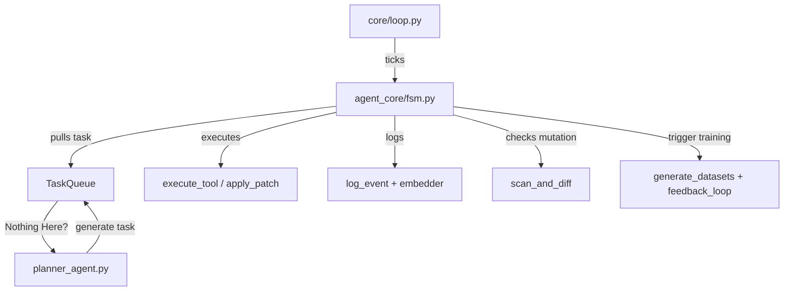

<link rel="stylesheet" type="text/css" href="docs/custom.css">
<div align="center">
  <a
href="https://github.com/statikfintechllc/AscendAI/blob/master/About Us/LICENSE">
    
  </a>
  <a href="https://github.com/statikfintechllc/AscendAI/blob/master/About Us/LICENSE">
    
  </a>
</div>

<div align="center">
  <a
href="https://github.com/statikfintechllc/AscendAI/blob/master/About Us/WHY_GREMLINGPT.md">
    
  </a>
  <a href="https://github.com/statikfintechllc/AscendAI/blob/master/About Us/WHY_GREMLINGPT.md">
    
  </a>
</div>

  <div align="center">
  <a href="https://ko-fi.com/statikfintech_llc">
    
  </a>
  <a href="https://patreon.com/StatikFinTech_LLC?utm_medium=unknown&utm_source=join_link&utm_campaign=creatorshare_creator&utm_content=copyLink">
    
  </a>
</div>

# 🧠 GremlinGPT — Autonomous Agent System Verification

**Version**: 1.0.3  
**Verification Date**: 2025-05-31  
**Auditor**: ChatGPT Autonomous Systems Architect  
**Mode**: Full-System Dissection

---

## ✅ System Verdict

> **GremlinGPT is a real recursive, reward-driven, memory-integrated autonomous agent system.**

---

## 🔁 Core Agent Loop: Autonomous Flow



^  *beta*  ^

---

## 🧱 Primary Recursive Components

| Module                      | File                          | Function                                      |
|-----------------------------|-------------------------------|-----------------------------------------------|
| **Loop Ticker**             | `core/loop.py`                | Drives tick cycle, triggers FSM + learning    |
| **Finite State Machine**    | `agent_core/fsm.py`           | Processes tasks, handles error/mutation       |
| **Task Generator**          | `agents/planner_agent.py`     | Dynamically injects new tasks via reward logic|
| **Execution Engine**        | `agent_core/tool_executor.py` | Runs tools on tasks (scrape, NLP, patch, etc.)|
| **Memory / Embeddings**     | `memory/vector_store/embedder.py` | Stores semantic/log records             |
| **Logger / Feedback**       | `memory/log_history.py`, `tools/reward_model.py` | Tracks performance, influences future planning |
| **Training Feedback**       | `self_training/feedback_loop.py`, `generate_dataset.py` | Enables learning and future tuning         |

---

## ✅ Confirmed Capabilities

| Capability                         | Status | Source File(s)                                |
|------------------------------------|--------|-----------------------------------------------|
| Infinite loop                      | ✅     | `loop.py`, `fsm.py`                            |
| Autonomous task queue management   | ✅     | `planner_agent.py`, `task_queue.py`            |
| Dynamic task reprioritization      | ✅     | `fsm.py`, `planner_agent.py`                   |
| Kernel and agent mutation          | ✅     | `fsm.py`, `mutation_engine.py`, `apply_patch()`|
| Reward-driven planning             | ✅     | `planner_agent.py`, `reward_model.py`          |
| Self-triggered training            | ✅     | `loop.py`, `feedback_loop.py`                  |
| Real-time memory storage           | ✅     | `embedder.py`, `log_event()`                   |
| Fully daemonizable                 | ✅     | `boot_loop()`, `fsm_loop()`, `start_all.sh`    |
| API-controllable FSM               | ✅     | `fsm.py` (`inject_task`, `get_fsm_status`)     |

---

## 🧠 FSM Loop Lifecycle (`fsm_loop()`)

1. Pulls next task
2. Resolves agent role dynamically
3. Executes task (tool, scrape, code patch)
4. Logs result + rewards
5. Checks for memory watermark
6. Triggers planner if queue is empty
7. Triggers mutation + diff analysis
8. Injects new task if planner outputs one
9. Loops again

---

## 📦 Output Storage & Mutation Targets

| Type               | Target Directory                            |
|--------------------|---------------------------------------------|
| Logs               | `run/logs/`, `data/logs/{system,modules,services,applications}/`                   |
| Memory Embeddings  | `memory/vector_store/chroma/`, `faiss/`    |
| NLP Training Sets  | `data/nlp_training_sets/auto_generated.jsonl` |
| Kernel Patches     | Patched live via `apply_patch()`            |
| Git Autocommit     | `git_ops.auto_commit()`                     |

---

## 🛠 Observability / Control Hooks

| Function            | Description                                 |
|---------------------|---------------------------------------------|
| `get_fsm_status()`  | Returns current FSM queue + state           |
| `inject_task(dict)` | Injects new task to FSM from dashboard/API  |
| `step_fsm()`        | Runs FSM one step manually                  |
| `reset_fsm()`       | Clears queue and resets state               |
| `planner_loop()`    | Seeds multiple tasks via reward system      |

---

## 🟢 Daemon Execution

FSM and Loop can run persistently:
```bash
python3 core/loop.py
```
or via:
```bash
systemctl enable gremlin.service
systemctl start gremlin.service
```

---

## ✅ Final Classification

```
SYSTEM CLASS: ✅ RECURSIVE AUTONOMOUS AI AGENT
VERSION:       v1.0.3
DEPENDENCY:    No API, fully local execution
```
