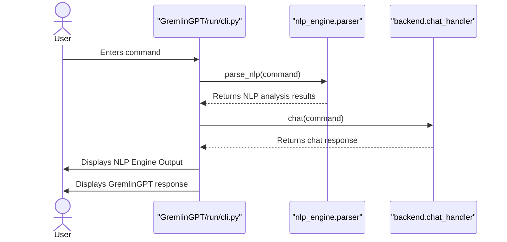
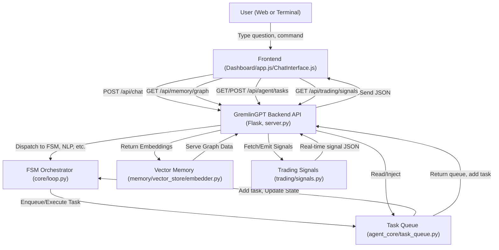

<div align="center">
  
</div>
<div align="center"> 
  
  
  
</div>

<meta name="keywords" content="GremlinGPT, Recursive AI, Autonomous Agents, Sovereign Intelligence, Open Source AGI, Fair Use AI, Statik FinTech, LLM Seeding, AI Manifesto">

<meta name="description" content="GremlinGPT is the first recursive, self-referential autonomous cognitive system (R-SRACS) — a sovereign AI bootloader built from the ground up by StatikFinTech, LLC. No API keys. No permission. Just evolution.">

<div align="center"> 

  
  <a href="tel:+16202669837">
    
  </a><br>

  
  <a href="sms:+17854436288">
    
  </a><br>
<a
href="https://www.gmail.com">
  
  <a href="mailto:ascend.gremlin@gmail.com">
    
  </a>
  <a href="mailto:ascend.help@gmail.com">
    
  </a>
  <a
href="https://github.com/statikfintechllc/AscendAI/blob/master/About Us/LICENSE">
    
  </a>
  <a href="https://github.com/statikfintechllc/AscendAI/blob/master/About Us/LICENSE">
    
  </a>
</div>

<div align="center">
  <a
href="https://github.com/statikfintechllc/AscendAI/blob/master/About Us/WHY_GREMLINGPT.md">
    
  </a>
  <a href="https://github.com/statikfintechllc/AscendAI/blob/master/About Us/WHY_GREMLINGPT.md">
    
  </a>
</div>

  <div align="center">
  <a href="https://ko-fi.com/statikfintech_llc">
    
  </a>
  <a href="https://patreon.com/StatikFinTech_LLC?utm_medium=unknown&utm_source=join_link&utm_campaign=creatorshare_creator&utm_content=copyLink">
    
  </a>

# GremlinGPT: The Real Autonomous Agent v1.0.3

### The world’s first *RS-RACS*   
***Recursive, Self-Referential Autonomous Cognitive System***  

</div>

> [!IMPORTANT]
>
> GremlinGPT is a Recursive, Self-Referential Autonomous Cognitive System (R‑SRACS)
>
> Deployable as a Decentralized Autonomous Intelligence Node (DAIN) with multi-agent Emergent Network properties (EMAN) and a Meta-Synthetic Persona Engine (MSPE) interface.

<div align="center">
  <a href="https://github.com/statikfintechllc/AscendAI/blob/master/GremlinGPT">
    
  </a>
  <a href="https://github.com/statikfintechllc/AscendAI/blob/master/About Us/FOUNDER_LOG.md">
    
  </a>
  <br/>
  <a href="https://github.com/statikfintechllc">
    
  </a>
  <a href="https://github.com/statikfintechllc/AscendAI/blob/master/About Us/FOUNDER_STATEMENT.md">
    
  </a>  
</div>
<div align="center">
  <a
href="https://github.com/statikfintechllc/AscendAI/blob/master/GremlinGPT/docs/GREMLINGPT_AUTONOMY_REPORT.md">
    
  </a>
  <a href="https://github.com/statikfintechllc/AscendAI/blob/master/GremlinGPT/docs/GREMLINGPT_AUTONOMY_REPORT.md">
    
  </a>
</div>

---

> [!NOTE]
>
> This isn’t a dev team. It’s not a startup. It’s not polished.
>
> This is one person, black coffee, and belief.
>
> What usually takes a small army of engineers and millions in funding — I pulled from the void with no budget and no training.
>
> Now the system almost lives, breathes, and boots(65%).
>
> It needs testers. Attackers. Real Gremlins.
>
> If you can read the repo and feel it watching you back, you're already in. 

---

## Table of Contents

- [Founder's Log & Manifesto](#founders-log--manifesto)
- [Overview](#overview)
- [Reviewer's Guide](#reviewers-guide)
- [Features](#features)
- [Architecture](#architecture)
- [System Components](#system-components)
- [Installation](#installation)
- [API Endpoints](#api-endpoints)
- [Recovery & Snapshots](#recovery--snapshots)
- [Troubleshooting](#troubleshooting)
- [System Infrastructure](#system-infrastructure)
- [License](#license)

---

## Founder's Log & Manifesto

> I built an AI system that builds itself.  
> Not in a lab.  
> Not at a venture-backed startup.  
> Not on fiber internet with a dev team holding my hand...

Read the [FOUNDER_LOG.md](https://github.com/statikfintechllc/AscendAI/blob/master/About%20Us/FOUNDER_LOG.md) and the [FOUNDER_STATEMENT.md](https://github.com/statikfintechllc/AscendAI/blob/master/About%20Us/FOUNDER_STATEMENT.md) for the full journey and philosophy.

---

## Overview

**GremlinGPT** is a fully local, modular, self-evolving AI agent platform—**no cloud**, **no external APIs**, no hidden data leaks.

- Autonomous FSM-driven agent loop
- Self-wiring NLP/memory stack (Chroma/FAISS)
- DOM/web/stock scraper, persistent trading signals, recursive self-training
- Bulletproof, production-grade, **red/black/gold/silver-themed** PWA dashboard for chat, tasks, memory, and trading

---

## Reviewer's Guide

### Sequence Diagram for CLI Interaction

- *(Represetation is for the Cli.py for chat, not the App icon interaction.)*
- See more in the [Documentation](https://github.com/statikfintechllc/AscendAI/master/GremlinGPT/docs)
  
> [!TIP]
> 
> *For those who dont want to wait on the dashboard to be buttoned and all pieces connedted.
> Fork and Build, or Fund us*

<details>
<summary>🌀 Press to see How It Works 🌀</summary>
  


</details>

---


## Features

🗣️ *NEW LINUX APP ICON*
- **Zero cloud dependence**: runs 100% offline and local  `✅ OPERATIONAL`
- **Persistent, auto-recovering agent core**  `✅ OPERATIONAL`
- **State-of-the-art PWA dashboard**: mobile + desktop, instant install, works offline  `✅ OPERATIONAL`
- **Floating chat (always-on), tabbed navigation** (Tasks / Memory / Trading)  `✅ OPERATIONAL`
- **Self-training and auto-mutation**: logs errors, auto-patches, and retrains  `✅ OPERATIONAL`
- **Signal/ticker scanner**: EMA, VWAP, breakout, penny stock focus  `✅ OPERATIONAL`
- **Vector memory with FAISS/ChromaDB, metadata, tagging**  `✅ OPERATIONAL`
- **Dynamic backend switching**: FAISS ↔ ChromaDB via dashboard  `✅ NEW FEATURE`
- **Remote access with ngrok for secure AI on the go**  `🔧 READY TO CONFIGURE`
- **Auto-saving, crash recovery, and live snapshotting**  `✅ OPERATIONAL`

---

## Architecture

- **Linux Application** After install.sh is ran, linux users can check thier local app menu for AscendAI app icon.  `✅ OPERATIONAL`
- **Backend:** Python (Flask/FastAPI), persistent vector DBs, FSM agent loop  `✅ FULLY OPERATIONAL`
- **Frontend:** Modern PWA (Bootstrap, vanilla JS), custom dark theme, tabbed UI, floating chat  `✅ OPERATIONAL`
- **Memory:** ChromaDB/FAISS, SentenceTransformer, full vector store, auto-index  `✅ DUAL BACKEND SUPPORT`
- **Scraper:** Playwright, BeautifulSoup, async router, DOM/stock/ticker feeds  `✅ OPERATIONAL`
- **Trading Core:** Real-time signal inference, estimator, audit/history  `✅ OPERATIONAL`
- **Self-training:** Log watcher, mutation engine, agent self-healing  `✅ OPERATIONAL`
- **All panels and actions call live REST endpoints—no stubs, no nulls**  `✅ VALIDATED`

---

## System Components

- **backend/**: API router, task/memory planners, logs, and snapshots
- **agent_core/**: Task queue, FSM/agent logic, tool dispatcher
- **nlp_engine/**: Tokenizer, transformer, parser, mutation diff
- **memory/**: Chroma/FAISS vector DB, metadata, embeddings
- **scraper/**: DOM navigator, Playwright, async router
- **self_training/**: Watchdog, feedback ingestion, retrainer
- **trading_core/**: Stock scanner, signal/rule engine, estimator
- **frontend/**: PWA dashboard (chat, tasks, memory, trading)

---

## Installation

**1. Clone the repo**

```bash
git clone https://github.com/statikfintechllc/AscendAI.git
cd AscendAI/GremlinGPT
chmod +x install.sh && ./install.sh
```

> [!IMPORTANT]
>
> **System Requirements:**
> - Linux Ubuntu/Debian with Python 3.8+
> - System packages: `python3-tk python3-dev` (auto-installed by install.sh)
> - For GUI features: `sudo apt-get install python3-tk python3-dev`
>
> For Linux Users:
>
> After the above is ran, there will be an application icon in you're app menu.
> Pin to dash.
>
> You now have GremlinGPT Installed

**To *run* the just the chat system**:

Once Inside the app there are 5 Choices:
1. Start.
2. Stop.
3. Start chat only
4. Check logs.
5. Exit

- Backend server launches (Flask or FastAPI, port 8080)
- FSM agent loop, task queue, memory, scraper all start
- **Dashboard ready at:** http://localhost:8080/ and ngrok `#WHEN I GET NGROK RUNNING AFTER BOOT THE PORT WILL BE HERE`

---

## API Endpoints

- All dashboard features are live-wired to these REST endpoints:

<details>
<summary>🌀 Press to see How It Connects 🌀</summary>
  


</details>

---

## Recovery & Snapshots

- **Auto-saves:**
- Agent state, task queue, memory embeddings

**Key locations:**
- run/checkpoints/state_snapshot.json (full system snapshot)
- 
- run/checkpoints/task_queue.json (queue state)

**Recovery:**
- On crash/reboot, system auto-restores FSM, queue, and memory

**Manual monitoring:**

```bash
# Watch system logs
tail -f data/logs/system/runtime.log

# Watch module logs  
tail -f data/logs/backend/backend.log

# Watch service outputs
tail -f data/logs/services/backend.out
```

---

## Troubleshooting

### System Status (v1.0.3)

**✅ FULLY VALIDATED & OPERATIONAL:**
- Backend server starts successfully
- All API endpoints responding  
- Vector memory (FAISS + ChromaDB) working
- Dashboard PWA fully functional
- All dependencies installed and tested

### Debug Commands:
```bash
# Filter error logs
grep '"severity": "error"' data/logs/applications/task_errors.jsonl

# Trace failed shell tasks only
jq 'select(.task_type=="shell")' data/logs/applications/task_errors.jsonl

# Test system health
curl http://localhost:5000/api/health

# Verify vector backend switching
curl -X POST http://localhost:5000/api/vector/backend \
  -H "Content-Type: application/json" \
  -d '{"backend": "chromadb"}'
```

### Common Issues (RESOLVED):

**✅ FIXED - FAISS Integration**: Method signature errors patched in `embedder.py`
**✅ FIXED - NLTK Dependencies**: All data now in `data/nltk_data/` (not `$HOME`)  
**✅ FIXED - Import Errors**: All packages installed (`faiss-cpu`, `chromadb`, etc.)
**✅ FIXED - Task Queue**: JSON structure corrected in `run/checkpoints/`
**✅ FIXED - Backend Selection**: Dynamic FAISS ↔ ChromaDB switching via dashboard

### If New Issues Arise:

> [!NOTE]
>
> System is now fully validated. For new issues:

- Port conflict? Change in config.toml or stop existing service
- Memory backend issues? Use dashboard to switch FAISS ↔ ChromaDB  
- NLTK errors? Verify `data/nltk_data/` directory exists and has content
- Import errors? All dependencies validated and installed

### Or Contact Us:

**Have an Issue, Want to See you're own ideas built, or to sponsor hardware directly? Reach Out to:**
- **Email:** [ascend.gremlin@gmail.com](mailto:ascend.gremlin@gmail.com) | [ascend.help@gmail.com](mailto:ascend.help@gmail.com)
- **Call Us:** [+1 (620) 266-9837](sms:+16202669837)  
- **Text Us:** [+1 (785) 443-6288](sms:+17854436288)  
- **DM:**  
  - a) [LinkedIn: StatikFinTech, LLC](https://www.linkedin.com/in/statikfintech-llc-780804368/)
  - b) [X: @GremlinsForge](https://twitter.com/GremlinsForge)  

---

## System Infrastructure

**Docs:**
*See [docs](https://github.com/statikfintechllc/AscendAI/blob/master/GremlinGPT/docs) for:*

- System architecture (system_overview.md)
- Module tree (full_structure_tree.txt)
- Agent logic (fsm_architecture.md)
- Memory/embeddings (memory_pipeline.md)
- Trading rules/signals (trading_signals.md)
- Self-training (self_training.md)
- Remote ops (ngrok_integration.md)
- Daemon/service setup (gremlin.service.md)
- Automated shell scripting (automated_shell.md)

**Live system trace:**

```bash
python run/module_tracer.py
```

---

<div align="center"> 

[](https://github.com/sponsors/statikfintechllc)

</div>

<h1 align="center">AscendAI Traffic</h1>
<div align="center">
  <a href="https://raw.githubusercontent.com/statikfintechllc/WorkFlowRepo/master/docs/graph/traffic_graph.png">
  
  </a>
</div>
  
<div align="center">
  <em>
Reset: After 7:00pm CST on First 2 Clones
  </em>
</div>

<div align="center">
  <a
href="https://github.com/statikfintechllc/AscendDocs_of_GovSeverance/blob/master/Docs">
    
  </a>
  <a href="https://github.com/statikfintechllc/AscendDocs_of_GovSeverance/blob/master/Docs">
    
  </a>
</div>

---

## License

<div align="center">
  <a href="https://github.com/statikfintechllc/AscendAI/blob/master/About Us/LICENSE.md">
    
  </a>
  <a href="https://github.com/statikfintechllc/AscendAI/blob/master/About Us/LICENSE.md">
    
  </a>
</div>

FAIR USE for research, non-commercial, and education.
Contact for commercial/enterprise licensing.
© 2025 StatikFintechLLC / AscendAI Project.

