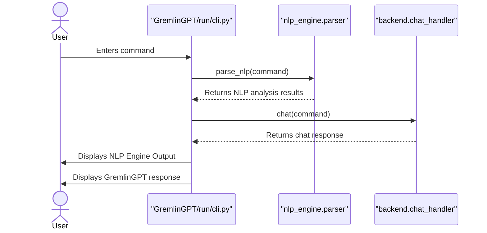

<link rel="stylesheet" type="text/css" href="docs/custom.css">

  
  

  
  

  

  
  

<h1 align="center">GremlinGPT: The Real Autonomous Agent v1.0.3</h1>

  
  
   
  
    

  
  

---

# Reviewer's Guide

> *This PR brings the JSON traffic datasets up to date and introduces a new command-line interface under `GremlinGPT/run` for interactive NLP engine access.*

## Sequence Diagram for New CLI Interaction

